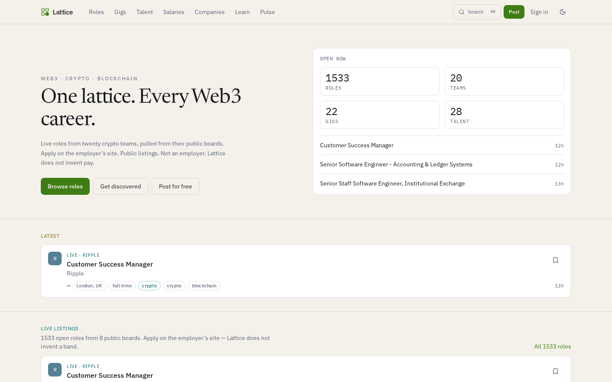
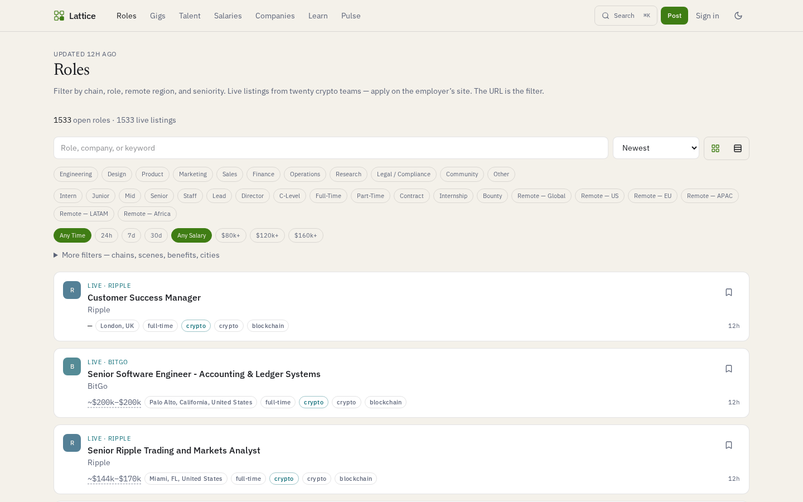
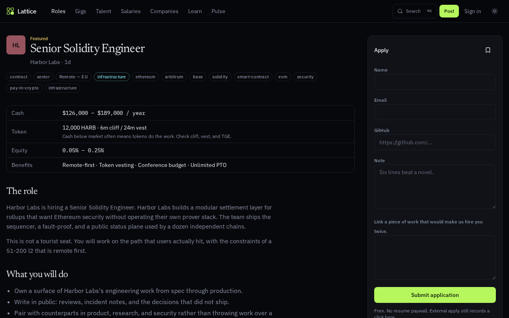
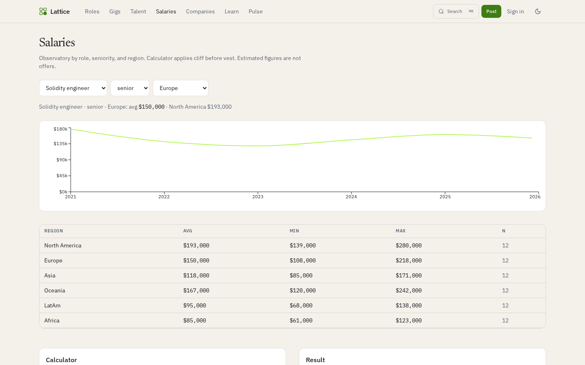
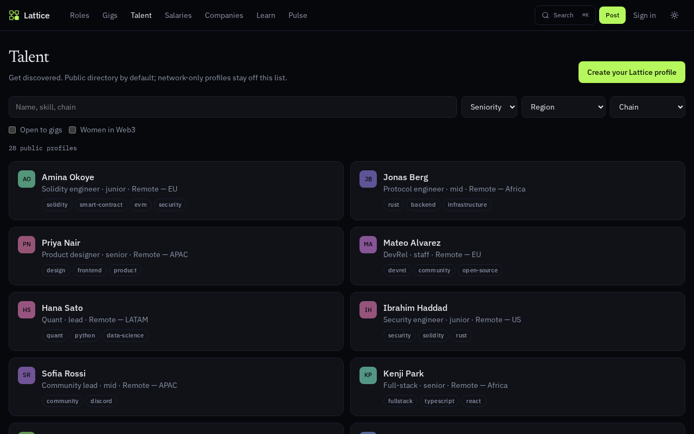

# Lattice

**Web3 jobs, crypto careers, blockchain roles** — live from employer ATS boards. Roles, gigs, talent, salaries, and companies — without five tabs and a paywall.

<p align="left">
  
</p>

[](https://lattice-devtechedge1.vercel.app)
[](https://github.com/devtechedge/lattice/actions/workflows/ci.yml)
[](https://tanstack.com/start)
[](https://react.dev/)
[](https://www.typescriptlang.org/)
[](https://tailwindcss.com/)
[](LICENSE)

---

## Live Demo

**https://lattice-devtechedge1.vercel.app**

> **Status:** Production is a **live job board**. Roles come from twenty crypto teams’ public Greenhouse, Lever, and Ashby boards (Coinbase, Binance, OKX, Bybit, Ripple, Kraken, Fireblocks, Crypto.com, Chainalysis, Blockchain.com, BitGo, Gemini, Alchemy, Phantom, Circle, Uniswap Labs, Ledger, Consensys, Ethereum Foundation, Solana Labs). Apply on the employer’s site. **Pay is only shown when the board publishes it** (posted metadata or inferred from the posting, marked `~`). Lattice does not invent a band. Talent, gigs, and learn remain a small editorial catalog. Posted listings, applications, bookmarks, and salary submissions persist in Postgres when `DATABASE_URL` is set. Without it the app uses embedded PGLite and reseeds on cold start. Sign-in is optional (bookmarks, applications, and talent profiles). Public listings. Not an employer. Not an offering. No wallet connect.

This is the **only** public repo for the product.

### Sister product

**[Jobrow](https://jobrow.vercel.app)** indexes still-open **US tech** roles from public ATS boards. Lattice stays on **blockchain / crypto / Web3**. Source: [devtechedge/job-board](https://github.com/devtechedge/job-board).

---

## Screenshots

| Home | Roles |
|------|-------|
|  |  |

| Role | Salaries |
|------|----------|
|  |  |

| Talent |
|--------|
|  |

Share card: [docs/screenshots/social-preview.png](docs/screenshots/social-preview.png)

---

## Features

- Editorial homepage: latest live role, twenty-team strip, new-this-week, companies hiring, manifesto
- Roles index with table and card views, persisted locally
- Live openings from twenty first-party ATS boards (Greenhouse, Lever, Ashby). Apply on the employer’s site; pay is posted or inferred (`~`), never invented
- Filters for chain, scene, department, seniority, remote region, benefits, pay-in-crypto
- Compensation as cash + token + equity, with vesting and cliff on the card
- Gigs marketplace and simulated digital contracts
- Public talent directory plus a privacy-flagged talent collective
- Salary observatory (mean / min / max, seniority, region, language sparkline)
- Anonymous salary submit, alerts / RSS view, market pulse, learn hub
- Free employer post (Markdown, preview, no account required)
- Apply flow with screening questions; studio desk for inbound applications
- Light / dark theme (persisted), command palette, hover-reveal scrollbars

---

## Tech Stack

| Layer | Technology |
|-------|------------|
| App | TanStack Start, React 19, TypeScript, Tailwind v4 |
| Data | Live ATS fetch in `src/lib/server/live.ts`. Talent / gigs / learn in `src/lib/catalog`. Postgres when `DATABASE_URL` is set; embedded PGLite otherwise |
| Auth | Optional Better Auth session for bookmarks, applications, and profiles |
| Hosting | Vercel |
| License | MIT |

---

## Quick Start

```bash
git clone https://github.com/devtechedge/lattice.git
cd lattice
npm install
npm run dev
```

Without `DATABASE_URL` the app uses embedded PGLite and seeds the catalog on first load.

```bash
npm run typecheck
npm test
npm run test:e2e
npm run build
```

Env template: [.env.example](.env.example). Never commit secrets.

| Variable | Where | Purpose |
|----------|--------|---------|
| `DATABASE_URL` | Vercel | Neon pooled URI (`sslmode=require`). Omit locally. |

See [SECURITY.md](SECURITY.md) for the threat model, reporting, and residual risk (guest posting, anonymous salary submit).

---

## License

MIT. See [LICENSE](LICENSE).
